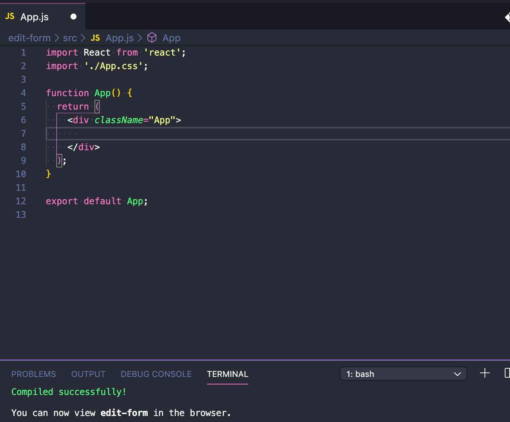

情報を探しても意外に出てこなかったので、Reactで以下のような編集フォームを作成するためのメモ。


[](https://gyazo.com/816e29f7ab89c608d09e3ddfd0883baf)

まず、create-react-appで雛形アプリを作成。

```shell
npx create-react-app edit-form
cd edit-form
yarn start
```


App.jsの中身は以下のように空っぽにしておく。



これで作業の準備は整った。

それでは、本題の編集フォームを入れる＜EditForm /＞というコンポーネントを作成してみる。


```js
（src／EditForm.js）

import React, { Component } from "react"

export default class EditForm extends Component {
  constructor(props) {
    super(props)
    this.state = {
      input: "",
      editing: true,
    }
    this.handleEditing = this.handleEditing.bind(this)
    this.handleSubmit = this.handleSubmit.bind(this)
  }
  render() {
    const { editing } = this.state
    return (
      <div>
        <h1>EditForm</h1>
        <form>
          {editing ? (
            <div>
              <input
                onChange={(e) => {
                  this.setState({ input: e.target.value })
                }}
                type="text"
                value={this.state.input}
              />

              <button onClick={this.handleSubmit}>Save</button>
            </div>
          ) : (
            <div>
              <span>{this.state.input}</span>
              <button onClick={this.handleEditing}>Edit</button>
            </div>
          )}
        </form>
      </div>
    )
  }

  handleEditing(e) {
    e.preventDefault()
    this.setState({
      editing: !this.state.editing,
    })
  }

  handleSubmit(e) {
    e.preventDefault()
    if (!this.state.input) return
    this.setState({
      input: this.state.input,
      editing: !this.state.editing,
    })
  }
}

```

あまり難しいことはしていない。

editingというstateを用意し、trueの時は文字列とEditボタンでfalseの時は入力フォームとSaveボタンが表示されるよう以下のような三項演算子を使用した。

```js
{editing ? (
            <div>
              （trueの時の表示）
            </div>
          ) : (
            <div>
              （falseの時の表示）
            </div>
          )
```

そして、EditボタンやSaveボタンの押した時のonClickで以下のようにtrue/falseを切り替えている。

```js
this.setState({ editing: !this.state.editing })
```

フォームの中身は、以下のようにしてonChangeが発火するたびに表示が切り替わるようになっている。

```js
<input
  onChange={(e) => {
    this.setState({ input: e.target.value })
  }}
  type="text"
  value={this.state.input}
/>
```

あとはフォームのvalueとして値が変更されたinputというstateが、SaveボタンのonClickで実行されるhandleSubmit( )で更新されればOK。
```js
handleSubmit(e) {
    e.preventDefault()
    if (!this.state.input) return
    this.setState({
      input: this.state.input, // ここでinputの値を更新して
      editing: !this.state.editing, // 同時にeditingをfalseに
    })
  }
```


作成した＜EditForm /＞を忘れずに＜App /＞でimportしておく。

```js
（src／App.js）

import React from "react"

import EditForm from "./EditForm"

function App() {
  return (
    <div className="App">
      <EditForm />
    </div>
  )
}

export default App

```

これで、Reactで文字列の編集ができるようになった。

[](https://gyazo.com/816e29f7ab89c608d09e3ddfd0883baf)

おわり。