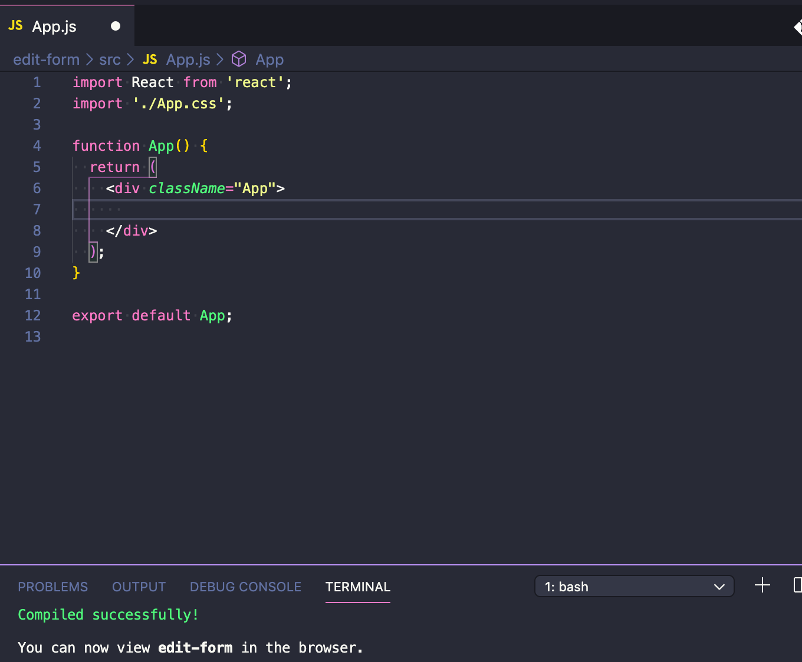

[](https://gyazo.com/816e29f7ab89c608d09e3ddfd0883baf)

I wanted to know how to make a static string editable by using react. But I couldn't easily find what I was looking for on the Internet so I'll post this memo for whoever needs to know how to build it.

First, let's run `create-react-app` sample app.

```shell
npx create-react-app edit-form
cd edit-form
yarn start
```


Remove everything inside `<div className="App"></div>`



Alright. Ready to go.

Next, as the main component, we're building ＜EditForm /＞ below.


```js
（src／EditForm.js）

import React, { Component } from "react"

export default class EditForm extends Component {
  constructor(props) {
    super(props)
    this.state = {
      input: "",
      editing: true,
    }
    this.handleEditing = this.handleEditing.bind(this)
    this.handleSubmit = this.handleSubmit.bind(this)
  }
  render() {
    const { editing } = this.state
    return (
      <div>
        <h1>EditForm</h1>
        <form>
          {editing ? (
            <div>
              <input
                onChange={(e) => {
                  this.setState({ input: e.target.value })
                }}
                type="text"
                value={this.state.input}
              />

              <button onClick={this.handleSubmit}>Save</button>
            </div>
          ) : (
            <div>
              <span>{this.state.input}</span>
              <button onClick={this.handleEditing}>Edit</button>
            </div>
          )}
        </form>
      </div>
    )
  }

  handleEditing(e) {
    e.preventDefault()
    this.setState({
      editing: !this.state.editing,
    })
  }

  handleSubmit(e) {
    e.preventDefault()
    if (!this.state.input) return
    this.setState({
      input: this.state.input,
      editing: !this.state.editing,
    })
  }
}

```

This might look more complicated than it actually is to some people. So I'll explain what's going on up there.

Using state called `editing` for rendering a couple of outputs, you can use ternary operator（ `condition` ? `true` : `false` ）to use a static string and a form at the exact same place in one component. When `editing is true`, it renders **Save** button next to the form. When `editing is false`, it renders **Edit** button next to the static string.


```js
{editing ? (
            <div>
              （when true）
            </div>
          ) : (
            <div>
              （when false）
            </div>
          )
```

Plus, when hitting either `Edit` or `Save` buttons, the state `editing` is switched between `true` and `false` by `setState` below  every time `onClick` gets triggered.

```js
this.setState({ editing: !this.state.editing })
```

And the value of the form always changes due to onChange event below.

```js
<input
  onChange={(e) => {
    this.setState({ input: e.target.value })
  }}
  type="text"
  value={this.state.input}
/>
```

Then, we can finish this by just defining `handleSubmit( )` which updates these `input` and `editing` only when the form is not empty.

```js
handleSubmit(e) {
    e.preventDefault()
    if (!this.state.input) return
    this.setState({
      input: this.state.input, // ここでinputの値を更新して
      editing: !this.state.editing, // 同時にeditingをfalseに
    })
  }
```

Finally, don't forget to import ＜EditForm /＞ inside of ＜App /＞.


```js
（src／App.js）

import React from "react"

import EditForm from "./EditForm"

function App() {
  return (
    <div className="App">
      <EditForm />
    </div>
  )
}

export default App

```

Done.  
Now you can use this ＜EditForm /＞ component anywhere in your application.

[](https://gyazo.com/816e29f7ab89c608d09e3ddfd0883baf)

Cheers, mate!

Tomoya