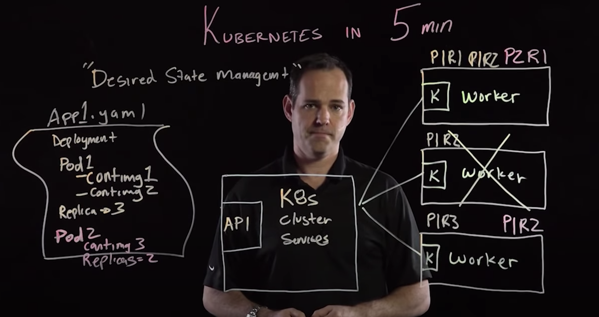

I'll take a note of Kubernetes because I didn't know well about this great technology even though I love everything made by Google.

Yes, **Kubernetes is originally made by an engineer of Google!**

## What is Kubernetes?
Kubernetes is an open source **container orchestration engine** for automating deployment, scaling, and management of containerized applications, published by Google in 2014. Now it is hosted by the Cloud Native Computing Foundation (CNCF).

## What is container orchestration?
Container orchestration is a system that efficiently manage and scale the containerized applications. As your application gets bigger and bigger, you'll need to upgrade the servers and add some new configurations, which also requires you to manage more containers for running the application. Then container orchestration will do complicated work instead of you.

### What does Kubernetes do?
Big picture, it just wraps up all the containers into "pods" which is more manageable and easier to change the configuration and deploy with CircleCI. Also, Kubernetes can balance the load from external networks on the dupulicated pods, and each pod automatically re-create the container when a container's server is down.

### Reference: 
[Kubernetes Documentation](https://kubernetes.io/) 
[Kerbenetes in 5 mins](https://youtu.be/PH-2FfFD2PU)

Tomoya