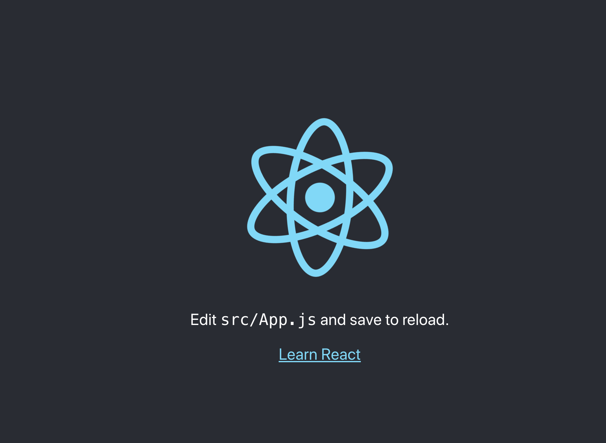
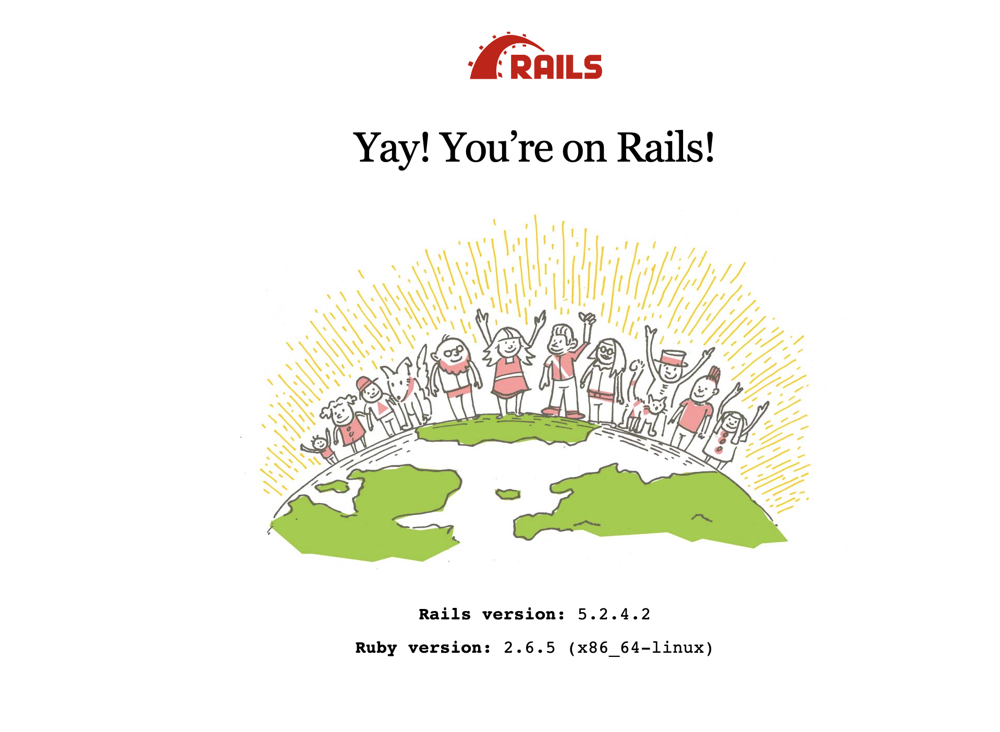

Hey, I'm Tomoya.
Currently I'm on deploying the application that I've developed with my great teammates. And along the way, I guess I'll need a memo of how we originally start this project. So I'm writing about it below.

I'll briefly explain how to set up a development environment of another Rails (API) × React × MySQL (MariaDB) project.
 (There are some inefficient codes that need to be fixed or improved since this is just a memo for myself. If you can read Japanese documents, you'd want to read more reliable sources at the bottom of this post.)


### Premise
 - For people who already have Dockerhub account
 - Just how to set up the development environment (not including detailed configuration of CORS, cookies, etc..)

### How to build
First, let's just make `sample_app` and move to the directry
まずは、使用するディレクトリを作成して、移動。

```terminal
mkdir sample_app
cd sample_app
```

Prepare following 4 files below.

```
 - Dockerfile
 - entrypoint.sh
 - Gemfile
 - Gemfile.lock
```

Dockerfile
```Dockerfile
FROM ruby:2.6.5
RUN apt-get update -qq && apt-get install -y build-essential libpq-dev nodejs
RUN mkdir /sample_app 
WORKDIR /sample_app
COPY Gemfile /sample_app/Gemfile
COPY Gemfile.lock /sample_app/Gemfile.lock
RUN bundle install
COPY . /sample_app

# Add a script to be executed every time the container starts.
COPY entrypoint.sh /usr/bin/
RUN chmod +x /usr/bin/entrypoint.sh
ENTRYPOINT ["entrypoint.sh"]
EXPOSE 3001

# Start the main process.
CMD ["rails", "server", "-b", "0.0.0.0"]
```

entrypoint,sh
```sh
#!/bin/bash
set -e

# Remove a potentially pre-existing server.pid for Rails.
rm -f /myapp/tmp/pids/server.pid

# Then exec the container's main process (what's set as CMD in the Dockerfile).
exec "$@"
```

Gemfile
```Gemfile
source 'https://rubygems.org'
ruby '2.6.5' # 使用したいバージョンを記載
gem 'rails', '< 6.0' # 使用したいバージョンを記載
```

Gemfile.lock
---> empty

Then make sure if you can build the image from `Dockerfile` you just created. Run `docker build [ -t ｛image name｝ [ :｛tag name｝ ] ] ｛the current directry that has Dockerfile｝`

```terminal
docker build -t tomoya/sample_image .
```

Run `docker images` and make sure you have the image just built by the previous command.

Next, let's create `docker-compose.yml`.

docker-compose.yml
```yml
version: "3"
services:
  db:
    image: mariadb # If you want to use MySQL, mariadb => mysql
    command: mysqld --character-set-server=utf8 --collation-server=utf8_unicode_ci
    environment:
      MYSQL_DATABASE: "sample_app_development"
      MYSQL_ROOT_PASSWORD: "password"
    volumes:
      - mysql-data:/var/lib/mysql/data
      - /tmp/dockerdir:/etc/mysql/conf.d/
    ports:
      - 3306:3306
  web:
    build: .
    command: bash -c "rm -f tmp/pids/server.pid && bundle exec rails s -p 3001 -b '0.0.0.0'"
    volumes:
      - .:/sample_app
    ports:
      - "3001:3001"
    depends_on:
      - db
volumes:
  mysql-data: {}
```

Now you can build the development environment of Rails (API) & DB (MariaDB) by running `docker-compose` command.

```terminal
docker-compose run web rails new . --force --no-deps -d mysql --api --skip-bundle
```

You just created the Rails (API) application.
Don't forget to add some configuration for DB in `database.yml` below.

database.yml
```yml
default: &default
  adapter: mysql2
  encoding: utf8
  pool: <%= ENV.fetch("RAILS_MAX_THREADS") { 5 } %>
  username: root
  password: "password"
  host: db
  socket: /var/run/mysqld/mysqld.sock

development:
  <<: *default
  database: sample_app_development
```

Next, let's create one more Dockerfile "`Dockerfile_node`" to set up React development environment.

Dockerfile_node
```Dockerfile
FROM node:13-alpine  
WORKDIR /usr/src/app/sample_app_front
```

Add some codes in `Docker-compose.yml`

Docker-compose.yml
```yml
version: "3"
services:
  db:
    image: mariadb
    command: mysqld --character-set-server=utf8 --collation-server=utf8_unicode_ci
    environment:
      MYSQL_DATABASE: "sample_app_development"
      MYSQL_ROOT_PASSWORD: "password"
    volumes:
      - mysql-data:/var/lib/mysql/data
      - /tmp/dockerdir:/etc/mysql/conf.d/
    ports:
      - 3306:3306
  web:
    build: .
    command: bash -c "rm -f tmp/pids/server.pid && bundle exec rails s -p 3001 -b '0.0.0.0'"
    volumes:
      - .:/sample_app
    ports:
      - "3001:3001"
    depends_on:
      - db
  node: # from here
    build:
      context: .
      dockerfile: Dockerfile_node
    volumes:
      - ./:/usr/src/app/sample_app_front
    command: sh -c "cd sample_app_front && npm start --host 0.0.0.0 --port 3000"
    ports:
      - "3000:3000"
    stdin_open: true # to here
volumes:
  mysql-data: {}
```

Finally, you can finish the set up by runnning this long command below.

```terminal
docker-compose run node sh -c "npm i -g create-react-app && ./node_modules/.bin/create-react-app sample_app_front"
```

Let's start up the servers by running `docker-compose up` and go to `localhost:3000` and `localhost:3001`.






Thanks for reading.  
Cheers.

Tomoya

### Reference:
 - [丁寧すぎるDocker-composeによるrails5 + MySQL on Dockerの環境構築(Docker for Mac)](https://qiita.com/azul915/items/5b7063cbc80192343fc0#%E7%92%B0%E5%A2%83rails5%E7%B3%BB%E3%81%A7%E4%BD%9C%E6%88%90%E3%81%97%E3%81%A6%E3%81%BE%E3%81%99)
 - [DockerでRuby on Rails + Reactを別々にアプリ作成する環境構築手順](https://qiita.com/dl10yr/items/b76969da1c2c33595a4a)
