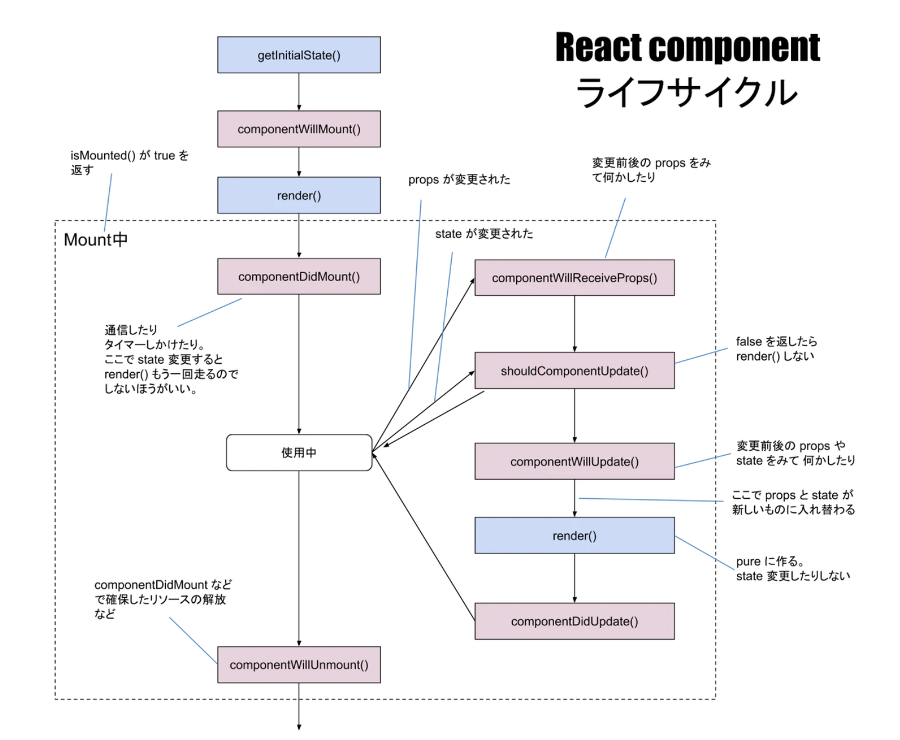

これまでRuby on Rails (以降Rorと呼ぶ)のアプリケーション開発では何度もデバッグ作業を経験したし、Rorのデバッグ方法についてまとめた記事は山ほど見つかる。だが、Reactのデバッグ作業に関するものはそこまで多くなかった。

よって、私が**Reactを使って開発した時に意識したものや使ったツール**等を備忘録として書き残しておく。

# 必要なツール、知識

 ### ・React Developer Tools
 

Facebookから公式で提供されているデバッグ用ツール。
コンポーネントツリーの構造、各コンポーネントに渡されているPropsの値、現在のStateの値などが視覚的に確認できる。

1つの画面でPropsやStateの状況をざっと把握できるので、エラーや不具合の原因箇所を大まかに把握するのに使っている。ある程度範囲を絞れたら、後述するconsole.log()等で本格的にデバッグを進める。

使い方は非常に簡単で、[こちら](https://chrome.google.com/webstore/detail/react-developer-tools/fmkadmapgofadopljbjfkapdkoienihi?hl=ja)でReact Developer Toolsの拡張版をインストールして、下記の画像の右側にあるように通常のChrome Developer Toolsの上部バーの`Components`をクリックするだけ。

詳しい使い方は、[こちらの記事](https://qiita.com/s_harada/items/3a06567c1e7d8ec8b178)がわかりやすかった。

### ・ Chrome Developer Tools
Webエンジニアの必携ツールと言っても過言ではないChrome Developer Tools。`optionキー + commandキー + i`で一瞬で起動し、コンソール上に出力されたログを確認したり、ブラウザ上で行われている通信の状況を全て把握できる。

React単体で言えば、console.log()の出力結果を確認する`Console`と前述の`React Developer Tools`だけでデバッグは可能。しかし、Reactのみで完結するよりも自作APIや外部のAPIからデータ等を引っ張ってくるケースが多いので、`Network`もデバッグに使用することが多い。

特に、**console.log**()は最も使用頻度が高い。

必要な値が変数に入っているか確かめたり、APIからのレスポンスの中身を出力できたりするのでデバッグに活用できる。

多用しすぎるとConsoleの画面が読みずらくなるので、`console.error()`であえて任意の値をエラー時のような赤で表示させることもある。

出力された回数を数えてくれる`console.count()`や、ある処理からある処理までにかかった時間を測ることのできる`console.time()`も便利。

 ### ・propsとstateをとにかく使い慣れること
Reactの開発には欠かせないのが、この**props**と**state**だ。  
Reactは**コンポーネント指向**で、それぞれのUIを基準に分けられた最小単位であるコンポーネントを複数組み合わせて１つの大きなUI（フロントエンド）を構築する。その際に、**props**と**state**が重要となる。

 - props
 親コンポーネントから渡されるproperty。  
 下方向（親 -> 子 -> 孫）にデータや関数を渡すことができる。

 - state
 そのコンポーネントの状態。
 propsとは異なり可変で管理可能なので、非同期で表示を変えたりエラーハンドリングに使えたりする。

この２つの概念は最初は理解しにくいと感じたが、実際に開発で使っていくうちに使い慣れて案外簡単に理解できた。意外と単純なので一度仕組みさえ理解すれば、デバッグも捗るはず。

 ### ・ライフサイクルメソッドの理解

[React component ライフサイクル図](https://qiita.com/kawachi/items/092bfc281f88e3a6e456)より引用

これはRorやその他Webアプリケーション開発で使用されるフレームワークにおけるMVCくらい重要。私はまだ「100%理解して使いこなせる」とは言い難いが、デバッグの際にこの概念を意識するだけで、処理が実行される順番やstateの状態などから原因を特定しやすくなる。

包括的に理解するには、[この記事](https://qiita.com/Julia0709/items/3c3fc8d29fd2e56ed7a9)がわかりやすい。

 ### ・公式ドキュメント（最強）
Rorや他の言語・フレームワークにも共通して言えることだが、公式ドキュメントを読むことが確固とした理解を得るための最適解であり、基本的な概念や書き方を深く理解することが最も効果的なデバッグに繋がる。

これからも、[React公式ドキュメント](https://reactjs.org/)は何度も何度も読み返そう。

Tomoya

参考にした記事：  
[Reactアプリのデバッグ方法](https://qiita.com/s_harada/items/3a06567c1e7d8ec8b178)  
[React における State と Props の違い](https://qiita.com/kyrieleison/items/78b3295ff3f37969ab50)  

