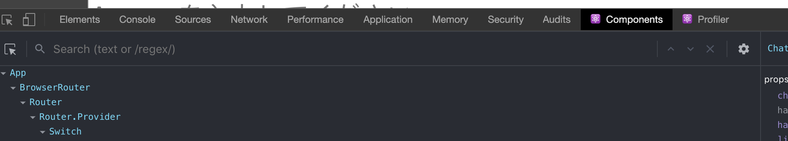
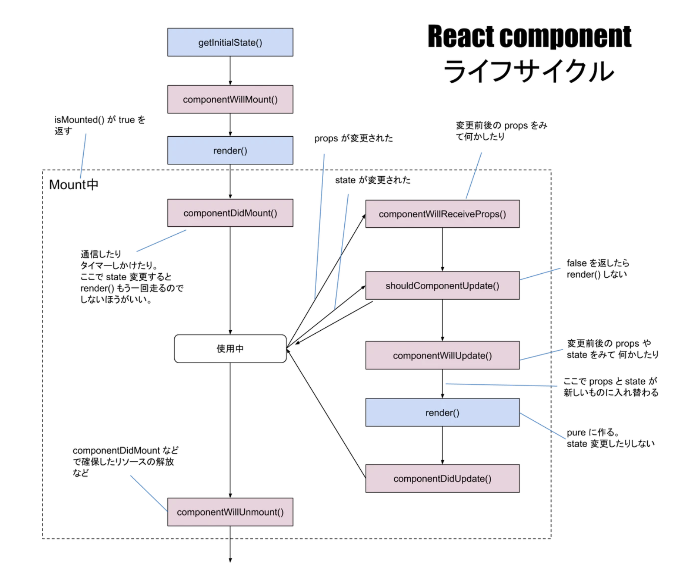

I've had quite much experiences on Ror (Ruby on Rails) projects, and I know there're bunch of info about how to debug on Ror development. On the other hand, I just realized **there aren't so many articles about how to debug in React.**

Therefore, this time I'll be taking a memo about debugging tools for React application and what I believe is important for debugging in React.

## What you need to know to debug in React

 ### ・React Developer Tools
 

`React Developer Tools` is open-source chrome extension made by Facebook. It just allows you to inspect the React component hierarchies and stuffs（props and state as well） in the Chrome Developer Tools.

I always use this tool for grasping the whole picture of the  props & state situation, and later on I end up with using `console.log` a lot to do a deep dive into the error.

You can install it [here](https://chrome.google.com/webstore/detail/react-developer-tools/fmkadmapgofadopljbjfkapdkoienihi?h1=en). After installed, you'll find `Components` tab right side in your Chrome Developer Tools.

### ・ Chrome Developer Tools
**Chrome Developer Tools** is the must-know tool for web developers. I always open it by shortcut keys (`option + command + i`) and inspect the console logs and data transmission on browser.

If your project is developed only with React, you can debug by using just `Console` on the Chrome Developer Tools and `React Developer Tools` just decribed above.

However, you'll need to make use of `Network` tab when fetching some data from external APIs or your API built with server-side language like Ruby, Python, etc..

Especially, using `console.log()` makes it easier to debug because it allows you to make sure if a variable has a certain value or if the React-side recieve a proper response from APIs.

Using too much `console.log()`s sometimes brings so many lines that you can't easily find the line you'd like to read. Then you can use `console.error()` to see more readable logs by making them red. (There're a lot more useful functions out there such as `console.count()` and `console.time()`. Check out [here](https://developer.mozilla.org/en-US/docs/Web/API/Console))

 ### ・Getting close to Props & State
**Props** and **State** are the two primary concepts of React.
React is **component-oriented**, meaning that components (building blocks divided by each UI of an application) are the core elements of the whole UI. And it is essential for React developers to understand how props and state work in each component.

 - Props
Values which are generally passed into a component from its parent. Props can only be passed one way down from parent to children.

 - State
State is mutable data, and it is maintained by the component itself; it is not passed from component to component.

Honestly it was not so easy for me to understand these two concepts. However, once you understand and use them for development, it will get way easier than you think they are.

 ### ・Understanding LifeCycle of components

From [React component ライフサイクル図](https://qiita.com/kawachi/items/092bfc281f88e3a6e456)

> Lifecycle methods are custom functionality that gets executed during the different phases of a component. ( React Documentation- reactjs.org)

This concept is as important as MVC modeling in Ror or any other types of web-development frameworks. Understanding how components pass each phase of its life drastically makes it easier to debug in React.

It's all in Japanese but [this article](https://qiita.com/Julia0709/items/3c3fc8d29fd2e56ed7a9) has a really good explanation of life cycle and how to make use of it by executing life cycle methods.

 ### ・Official Docs
When running into big errors and struggling with them, the key to solve them should always be in the official documentation. This makes sense for not only React but also Ror and other languages / frameworks. After all, the best understanding the basics of the language or the framework makes the most efficient debugging.

I'll read this [React Documentation](https://reactjs.org/) for thousands times more.  
Cheers!

Tomoya

Reference:  
[React Documentation](https://reactjs.org/)  
[Component Best Practices](https://preact.gitbooks.io/react-book/content/jsx/index.html)  
